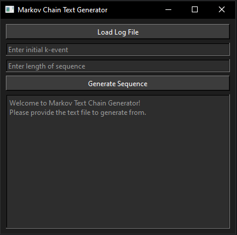

## Markov Text Generator

Projekt jest prostą implementacją pseudolosowego procesu - generacji tekstu na podstawie łańcucha Markowa, opartego na propozycji projektu z Princeton University.
Aplikacja wykorzystuje **framework Qt** do budowy graficznego interfejsu użytkownika (GUI).

### Klasa MarkovChain

Klasa `MarkovChain` zawiera logikę niezbędną do generowania tekstu na podstawie łańcucha Markowa.
Znajduje się w niej implementacja metod do wczytywania tekstu z pliku, budowy łańcucha Markova, oraz generowania nowego tekstu na podstawie zadanego początkowego fragmentu (k-event).

### Klasa MainWindow

Klasa `MainWindow` stanowi GUI aplikacji. Zawiera prosty interfejs z polami do wprowadzenia danych wejściowych (początkowego fragmentu k-event i długości generowanego tekstu) oraz przyciskami do obsługi akcji wczytywania pliku i generowania tekstu.

### Wymagania

- [CLion](https://www.jetbrains.com/idea/download/download-thanks.html?platform=windows&code=IIC)
- [Qt w wersji 6.x](https://www.qt.io/download-qt-installer-oss)

### Konfiguracja

Przed pierwszym uruchomieniem aplikacji, wykonaj następujące kroki w CLion:

1. Przejdź do menu i wybierz File > Settings > Build, Execution, Deployment > CMake
3. W polu "CMake options" wklej: `-DCMAKE_PREFIX_PATH="C:\Qt\6.7.1\mingw_64\lib\cmake"` wstawiając swoją ścieżkę do folderu lib\cmake instalacji Qt.
4. Zapisz zmiany i uruchom `MarkovChainGenerator.exe` lub metodę `main()` w klasie `main.cpp`.

### Korzystanie z aplikacji

Po uruchomieniu aplikacji, postępuj zgodnie z poniższymi krokami:

1. **Wczytanie pliku**: Kliknij przycisk "Load Log File" i wybierz plik tekstowy zawierający łańcuch znaków. Możesz użyć przykładowego pliku `logfile.txt` zlokalizowanym w `/resources/logfile.txt` lub dowolnego innego pliku tekstowego.

2. **Wprowadzenie danych wejściowych**: Wprowadź początkowy fragment tekstu (k-event) oraz żądaną długość wygenerowanego tekstu do odpowiednich pól tekstowych.

3. **Generowanie tekstu**: Kliknij przycisk "Generate Sequence" aby wygenerować tekst na podstawie wprowadzonych danych. Wygenerowany tekst pojawi się w polu poniżej.

